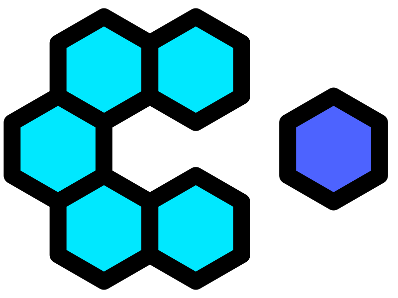

# lit-composition



[](https://github.com/JorisAerts/lit-composition/actions/workflows/test.yml)
[](https://www.npmjs.com/package/lit-composition)
[](https://www.npmjs.com/package/lit-composition)
[](https://github.com/JorisAerts/lit-composition?tab=MIT-1-ov-file)

A tiny toolkit for building Lit Web Components with less boilerplate.
It requires no decorators and allows developers to write approved standardized JavaScript / TypeScript.

## Why lit-composition?

- Reduce boilerplate when authoring LitElement components.
- Typed, object-based options instead of decorators.
- Composable lifecycle hooks you can call from plain functions.
- Standard JS/TS: works in TypeScript and plain JavaScript without experimental flags.

## Features

- TypeScript-first, but works in plain JS
- Lit-compatible props with optional defaults
- Composable lifecycle hooks (onConnected, onUpdated, …)
- Reactive state with useRef and derived values with computed
- Two ways to render: return a function from setup(), or provide render()
- Fast shorthand: defineElement('my-tag', () => html`...`)
- Shadow DOM control via shadowRoot: false
- Real LitElement subclass under the hood

## Table of contents

- Installation
- Setup
- Quick start
- Usage
- No decorators required
- Lifecycle hooks
- Props and defaults
- Shadow DOM control
- Refs and computed
- Context: provide & inject
- Options reference

## Installation

Peer requirements: lit >=3 (required), @lit/context >=1 (optional, only if you use context helpers).

```bash
pnpm add lit lit-composition
# or
npm i lit lit-composition
# or
yarn add lit lit-composition
```

If you want to use provide / inject:

```bash
pnpm add @lit/context
# or
npm i @lit/context
# or
yarn add @lit/context
```

## Setup

- TypeScript: No experimental decorators required. Recommended tsconfig: target ES2020+ (or latest your environment
  supports), module ES2020/ESNext, libs include DOM and ES2020. You do NOT need experimentalDecorators or
  emitDecoratorMetadata.
- Bundlers: Package is pure ESM with standard exports. Works out-of-the-box with Vite, Rollup, and Webpack 5+. No
  special plugins or config needed.
- Import paths: Most APIs come from 'lit-composition'. Context helpers live under the subpath '
  lit-composition/context' (see examples below).
- Peer deps: Install lit@^3. If you use context helpers, also install @lit/context.
- Runtime support: Modern evergreen browsers (Chromium, Firefox, Safari). For tooling scripts (not the browser), Node
  18+ is recommended.
- CDN (quick try):
  ```html
  <script type="module">
    import {defineElement} from 'https://unpkg.com/lit-composition/dist/index.js'
    import {html} from 'https://unpkg.com/lit@3/index.js'

    defineElement('hello-cdn', () => html`Hello from CDN`)
  </script>
  <hello-cdn></hello-cdn>
  ```

## Quick start

Minimal component with defineElement:

```ts
import {defineElement, onConnected} from 'lit-composition'
import {html} from 'lit'

const MyHello = defineElement({
    name: 'my-hello',
    props: {
        who: {type: String},
        excited: {type: Boolean},
    },
    setup() {
        onConnected(() => console.log('connected'))
        return () => html`Hello, ${this.who}${this.excited ? '!' : ''}`
    },
})
```

Fast one-liner (functional) form:

```ts
import {defineElement} from 'lit-composition'
import {html} from 'lit'

defineElement('my-hello', () => html`Hello, World!`)
```

## Usage

- defineElement(options) — object form. You can declare props, styles, and optionally a setup() that returns a render
  function. Prefer this when you need lifecycle hooks or state.
- defineElement(name, render) — shorthand functional form. Quick for simple stateless components.
- Context helpers are imported from 'lit-composition/context' (subpath export).

Examples for each concept are provided in the sections below.

## No decorators required

Classic Lit often uses decorators. With lit-composition you use plain options—no experimental TS flags.
You also need to use accessors, which are also not part of the standard JavaScript specification.

```ts
// Classic Lit: Decorators & non-standard accessors
import {LitElement, html} from 'lit'
import {customElement, property} from 'lit/decorators.js'

@customElement('my-hello')
class MyHello extends LitElement {
    @property()
    accessor who = 'World'

    render() {
        return html`Hello, ${this.who}`
    }
}
```

Using lit-composition, you can write the same component in plain, without decorators.

If you choose to not write an explicit render function, lit-composition can also provide a dedicated setup-scope where
you can access and manage the complete lifecycle of the
component.

The setup-function returns a render function:

```ts
// lit-composition (no decorators)
import {defineElement} from 'lit-composition'
import {html} from 'lit'

defineElement({
    name: 'my-hello',
    props: {who: {type: String, default: 'World'}},
    setup() {
        return () => html`Hello, ${this.who}`
    },
})
```

## Lifecycle hooks

Hooks map 1:1 to Lit lifecycle methods:

- onConnected(cb) → connectedCallback
- onDisconnected(cb) → disconnectedCallback
- onWillUpdate(cb) → willUpdate
- onPerformUpdate(cb) → performUpdate
- onFirstUpdated(cb) → firstUpdated
- onUpdated(cb) → updated
- onUpdate(cb) → update

Example:

```ts
import {defineElement, onConnected, onUpdated} from 'lit-composition'
import {html} from 'lit'

defineElement({
    name: 'with-hooks',
    setup() {
        onConnected(() => console.log('mounted'))
        onUpdated((changed) => console.log('updated', Array.from(changed.keys())))
        return () => html`<slot></slot>`
    },
})
```

## Props and defaults

The props option uses Lit’s property declaration shape. Types are inferred from constructors in TS.

Declarative defaults (literal or factory):

```ts
import {defineElement} from 'lit-composition'
import {html} from 'lit'

defineElement({
    name: 'with-defaults',
    props: {
        count: {type: Number, default: 1},
        enabled: {type: Boolean, default: true},
        options: {type: Object, default: () => ({dense: false})},
        items: {type: Array, default: () => [] as string[]},
    },
    render() {
        return html`${this.count} ${this.enabled} ${JSON.stringify(this.options)} ${this.items.length}`
    },
})
```

Imperative defaults in setup:

```ts
import {defineElement} from 'lit-composition'
import {html} from 'lit'

defineElement({
    name: 'with-props',
    props: {count: {type: Number}},
    setup() {
        this.count = 1
        return () => html`${this.count}`
    },
})
```

Precedence notes:

- Attributes/props passed by the user win over defaults.
- Values you set in setup() also win; defaults only fill undefined.

## Shadow DOM control

If you don't want to render the component in a shadow root, use `shadowRoot: false`. It's similar to overriding
createRenderRoot in a classic Lit element:

```ts
import {defineElement} from 'lit-composition'
import {html} from 'lit'

defineElement({
    name: 'light-dom',
    shadowRoot: false,
    render() {
        return html`<slot></slot>`
    },
})
```

## Refs and computed

Maintain small reactive bits of state that integrate with Lit updates without needing @state or @property. Use
`useRef()` for a mutable reactive value and `computed()` for derived values.

```ts
import {defineElement, useRef, computed} from 'lit-composition'
import {html} from 'lit'

defineElement({
    name: 'with-refs',
    shadowRoot: false,
    setup() {
        const count = useRef(0)
        const doubled = computed(() => count.value * 2)
        return () => html`<button @click=${() => count.value++}>${count.value} → ${doubled.value}</button>`
    },
})
```

- `useRef(initial)` returns an object with a `.value` that triggers re-render on change.
- `computed(getter | {get, set})` creates a read-only or writable derived ref; it re-computes when any of its
  dependencies change.

You can also create refs outside a component and share them across multiple components. A ref is just a tiny reactive
container; it is not tied to any specific element instance. Any component that reads a shared ref will update when that
ref changes.

```ts
import {defineElement, useRef, computed} from 'lit-composition'
import {html} from 'lit'

// Module-scoped shared ref
export const sharedCount = useRef(0)

defineElement({
    name: 'counter-a',
    shadowRoot: false,
    setup() {
        const doubled = computed(() => sharedCount.value * 2)
        return () => html`<button @click=${() => sharedCount.value++}>A: ${sharedCount.value} → ${doubled.value}</button>`
    },
})

defineElement({
    name: 'counter-b',
    shadowRoot: false,
    setup() {
        return () => html`B sees: ${sharedCount.value}`
    },
})
```

### takeRef — use refs from "regular" Lit elements

`takeRef` is a small utility that lets you attach an existing `useRef()` or `computed()` ref to a plain `LitElement`
instance so that the element will subscribe to updates from that ref and request updates when the ref changes.

Why this exists

- `useRef()` and `computed()` return lightweight reactive containers that integrate with lit-composition's
  reactivity system. Components created with `defineElement()` automatically pick up refs that are read during their
  render/setup lifecycle. Classic `LitElement` classes don't participate in that setup lifecycle, so `takeRef` lets you
  manually register a `LitElement` instance as a subscriber for an existing ref.

API

- takeRef(element: ReactiveElement, ref: Effect<T>) => Effect<T>

Notes

- `takeRef` does not clone the ref — it returns the same ref you pass in. It simply registers the provided `element`
  as a subscriber so that when the ref changes the element's `requestUpdate()` is called.
- Works with both `useRef()` and `computed()`.

Examples

1) Using a shared `useRef` inside a classic `LitElement`:

```ts
import {LitElement, html} from 'lit'
import {useRef, takeRef} from 'lit-composition'

const shared = useRef(123)

class MyClassic extends LitElement {
    static properties = {ref: {type: Object}}

    constructor() {
        super()
        // register this element to receive updates when `shared` changes
        this.ref = takeRef(this, shared)
    }

    render() {
        return html`<div>${this.ref.value}</div>`
    }
}

customElements.define('my-classic', MyClassic)
```

2) Attaching a computed ref to a classic `LitElement`:

```ts
import {LitElement, html} from 'lit'
import {computed, takeRef} from 'lit-composition'

const comp = computed(() => 42)

class CompClassic extends LitElement {
    static properties = {ref: {type: Object}}

    constructor() {
        super()
        this.ref = takeRef(this, comp)
    }

    render() {
        return html`<div>${this.ref.value}</div>`
    }
}

customElements.define('comp-classic', CompClassic)
```

3) When using `defineElement()` you usually don't need `takeRef` because the setup/render lifecycle will subscribe
   automatically when you read refs. `takeRef` is intended for interoperability with non-defineElement consumers.

## Watching reactive state with `watch`

The `watch` function lets you run a callback when one or more refs or computed values change, similar to Vue's `watch`.
It is useful for responding to changes in state, performing side effects, or synchronizing with external systems.

**Usage:**

- `watch(refOrGetter, (newVal, oldVal) => { ... })`
- `watch([ref1, getter2], ([new1, new2], [old1, old2]) => { ... })`

The callback receives the new and previous value(s). The watcher runs only when the value(s) change. By default, the
callback is not called immediately on setup, but you can pass `{ immediate: true }` as a third argument to run it once
with the current value(s).

**Examples:**

```ts
import {defineElement, useRef, watch} from 'lit-composition'
import {html} from 'lit'

defineElement({
    name: 'my-watcher',
    setup() {
        const count = useRef(0)
        const label = useRef('')

        // Watch a single ref
        watch(count, (newVal, oldVal) => {
            console.log('Count changed from', oldVal, 'to', newVal)
        })

        // Watch multiple sources
        watch([count, label], ([newCount, newLabel], [oldCount, oldLabel]) => {
            console.log('Count or label changed:', {newCount, newLabel, oldCount, oldLabel})
        })

        // Watch with immediate option
        watch(count, (newVal) => {
            console.log('Immediate count:', newVal)
        }, {immediate: true})

        return () => html`
            <button @click=${() => count.value++}>Inc: ${count.value}</button>
            <input .value=${label.value} @input=${e => label.value = e.target.value} />
        `
    },
})
```

**Notes:**

- You can watch refs, computed values, or getter functions.
- The stop function returned by `watch` can be called to stop watching.

## Side effects with `watchEffect`

The `watchEffect` function runs a function immediately and re-runs it whenever any of its reactive dependencies change.
This is useful for simple reactive side effects that do not need access to previous values.

**Example:**

```ts
import {defineElement, useRef, computed, watchEffect} from 'lit-composition'
import {html} from 'lit'

defineElement({
    name: 'with-effect',
    shadowRoot: false,
    setup() {
        const count = useRef(0)
        const doubled = computed(() => count.value * 2)

        watchEffect(() => {
            console.log(`Count is ${count.value}, doubled is ${doubled.value}`)
        })

        return () => html`<button @click=${() => count.value++}>${count.value} → ${doubled.value}</button>`
    },
})
```

- `watchEffect(fn)` runs the given function immediately and re-runs it whenever any of its reactive dependencies change.
  Returns a stop function (currently a no-op).

## Context: provide & inject (with @lit/context)

lit-composition ships tiny helpers on top of @lit/context so you can share data across a component tree without
decorators.
They are fully interoperable with Lit’s own @provide and @consume decorators.

Install note: @lit/context is an optional peer dependency; install it if you use these helpers (see Installation above).

Basic usage

```ts
import {html} from 'lit'
import {defineElement} from 'lit-composition'
import {createContext} from '@lit/context'
import {provide, inject} from 'lit-composition/context'

// 1) Create a context once (module scope)
const userContext = createContext<{ name: string }>(Symbol('user'))

// 2) Provide somewhere high in your tree
defineElement({
    name: 'user-provider',
    setup() {
        provide(userContext, {name: 'Ada'})
        return () => html`<slot></slot>`
    },
})

// 3) Inject (consume) downstream
defineElement({
    name: 'user-greeting',
    shadowRoot: false,
    setup() {
        const user = inject(userContext) // ContextConsumer with a reactive .value
        return () => html`Hello, ${user.value.name}!`
    },
})
```

Interoperability with Lit decorators

You can mix and match providers/consumers across lit-composition and classic Lit components.

- defineElement provides → Lit consumes (@consume):

```ts
import {html, LitElement} from 'lit'
import {customElement} from 'lit/decorators.js'
import {consume as consumeDec, createContext} from '@lit/context'
import {defineElement} from 'lit-composition'
import {provide} from 'lit-composition/context'

const ctx = createContext<string>(Symbol('demo'))

defineElement({
    name: 'demo-provide',
    setup() {
        provide(ctx, 'ok')
        return () => html`<lit-consumer></lit-consumer>`
    },
})

@customElement('lit-consumer')
class LitConsumer extends LitElement {
    @consumeDec({context: ctx}) accessor value!: string

    render() {
        return html`<div>${this.value}</div>`
    }
}
```

- Lit provides (@provide) → defineElement consumes (inject):

```ts
import {html, LitElement} from 'lit'
import {customElement} from 'lit/decorators.js'
import {provide as provideDec, createContext} from '@lit/context'
import {defineElement} from 'lit-composition'
import {inject} from 'lit-composition/context'

const ctx = createContext<string>(Symbol('demo-2'))

@customElement('lit-provider')
class LitProvider extends LitElement {
    @provideDec({context: ctx}) accessor provided = 'from lit'

    render() {
        return html`<comp-consumer></comp-consumer>`
    }
}

defineElement({
    name: 'comp-consumer',
    shadowRoot: false,
    setup() {
        const v = inject(ctx)
        return () => html`<div>${v.value}</div>`
    },
})
```

Notes

- provide(context, value) and inject(context) must be called during setup(), so there is a current component instance.
- inject() returns a live ContextConsumer with a .value property and subscribes to updates; using .value in render will
  re-render when it changes.
- These helpers just wrap @lit/context under the hood; anything that works with @provide/@consume also works across
  lit-composition components.

## Options reference

Call it either as defineElement(options) or as a fast shorthand defineElement(name, render).

Supported defineElement options (compact overview):

- name?: string — tag name; auto-registers unless register: false
- register?: boolean — disable automatic customElements.define
- parent?: typeof LitElement — extend a custom LitElement base/mixin
- styles?: CSSResultGroup — equivalent to static styles
- props?: Record<string, PropertyDeclaration> — like Lit static properties
- shadowRoot?: boolean — false to render into light DOM
- setup?(this): () => RenderFn | void — runs in the constructor
- render?(this): RenderFn — provide render directly if you don’t need setup
